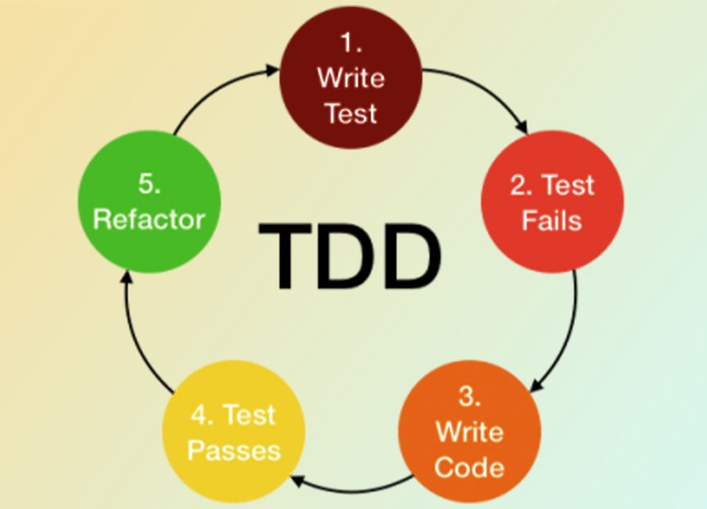

# TESTING

> Área de la programación que se enfoca en evaluar el comportamiento del código de forma aislada para determinar su comportamiento y utiliza diversas metodologías para lograr la creación de de aplicaciones estables y eficientes, una de ellas es el TDD (TEST DRIVEN DEVELOPMENT).

## Niveles de Testing

- Unitarios: Testean funcionalidades concretas, clases únicas, modos de fallo
  - Testeo de componentes básicos (Funciones)
  - Es en el que nos enfocaremos
- Integración: Múltiples clases, bases de datos, servicios de terceros
  - Integración entre distintos componentes
- Funcionales: IU (User Interface) y E2E (End to End)
  - El proyecto completo, interacción con el usuario

## Test Driven Development

- Desarrollo guiado por tests: Es un paradigma de trabajo
- Implementación de la "Caja Negra" (Black Box Testing)
  - Comparo "Expectativa" con "Resultado"
- Pasos del TDD:
  1. Desarrollamos los tests
  2. Verificamos que fallen
  3. Desarrollo de funcionalidad mínima para pasar los tests
  4. Si alguno falla, corrijo errores
  5. Refactoring: No modifico funcionalidad

## JEST:

- [Documentación](https://jestjs.io/)
- Framework de código abierto mantenido por el equipo de Facebook
- Fácil de utilizar y configurar
- Pruebas Simples: No necesita configuración adicional
- Integración con React: Optimizado para trabajar con React
- Cobertura de Código: Evalúa porciones de código testeadas
- Funciones Mock: Simular comportamientos durante las pruebas (sin ejecutar la función)
- Snapshot Testing: Capturar estado de un componente en un momento específico para prevenir cambios no deseados
