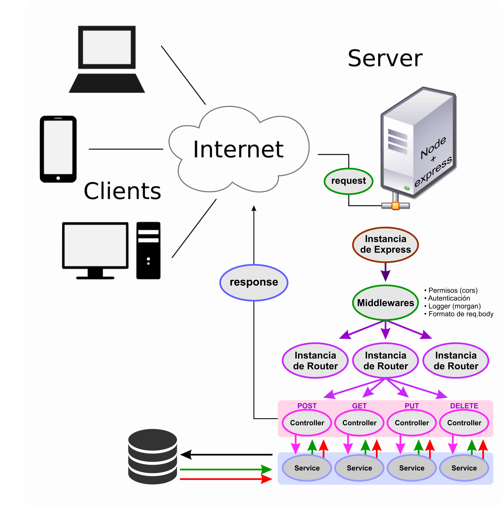

# Mongoose

## Documentación de Mongoose

- [Mongoose - Documentación](https://mongoosejs.com/)
- [Mongoose Schemas - Doc](https://mongoosejs.com/docs/guide.html)
- [Mongoose Validations - Doc](https://mongoosejs.com/docs/validation.html)

## ¿Qué es un SEGMENTO DE RUTA?

> Es cada segmento del path de la URL separado por una barra inclinada ("/").

En la siguiente URL: http://localhost:3000/home/discs/:id

- Protocolo de red utilizado: http
- Host: localhost
- Puerto: 3000
- Primer SEGMENTO DE RUTA: home
- Segundo SEGMENTO DE RUTA: discs
- Parámetro: :id
  - Se representa mediante ":id" en las rutas de Express
  - Tomará el valor que el cliente coloque en su lugar

## Repaso sobre responsabilidades de cada sección de nuestro Back-End

### 1. Instancia de "Express":
  - Establece el "Host" y "Puerto" donde escucha nuestro Servidor
  - Nos brinda todos las propiedades y métodos de "Express".

```js
// server.js
const express = require("express");
const server = express();

module.exports = server;

// index.js
const server = require("./src/server.js");

server.listen(PORT);
```

### 2. Middlewares:
  - Realizan un proceso previo del "Request" antes de derivarlo según el "path" que contiene.
  - Deriva el "Request" hacia la instancia de "Router" correspondiente según el "path".

```js
// server.js
// IMPORTACIONES
const cors = require("cors");
const express = require("express");
const morgan = require("morgan");

// MIDLEWARES
// Permitir acceso según URL, Método, Credenciales, etc:
server.use(cors());
// Indica por consola características de los Request recibidos:
server.use(morgan("dev"));
// Convierte los datos recibidos por "body" a objetos JS:
server.use(express.json());

// MIDLEWARES DE RUTAS
// Redirige a cada instancia de "Router" según el primer "Segmento de Ruta"
server.use("/", homeRouter);
server.use("/disc", discRouter);
```

### 3. Instancias de "Router":

  - Invoca al correspondiente "Controller" según el segundo "Segmento de Ruta", "Params" y el "Método HTTP" que trae el "Request".

### 4. Controllers:

  - Recibe los objetos "req" y "res".
  - Desestructura la información recibida por "Params", "Query" y/o "Body".
  - Realiza las validaciones necesarias.
  - Maneja la lógica de la respuesta y los errores (try/catch).
  - Invoca a "Services" de ser necesario.
  - Da la respuesta al Cliente.

### 5. Services:
  - Realizan la comunicación con el exterior (API, BBDD, etc)
  - Pueden lanzar errores que serán capturados por los Controllers

## Resumen

