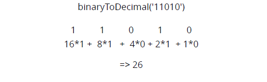

# Binary to Decimal

## Introducción

Escribe una función que pase un string en binario a un número decimal

## Solución

### En palabras

1. Iterar sobre cada número
2. Ir sumando: la potencia de 2 y, su posición, multiplicada por el número [1 ó 0].

#### Ejemplo



### Primer alternativa

```js
const binaryToDecimal = (binary) => {
    let sum = 0;
    for (let i = 0; i < binary.length; i += 1) {
        sum += Math.pow(2, binary.length - (i+1)) * binary[i];
    }
    return sum;
};
```

### Segunda alternativa

En este caso, se propone una **solución recursiva**.

```js
const binaryToDecimalRec = (binary) => {
    const sum = Math.pow(2, binary.length - 1) * binary[0]
    if (binary.length !== 1) {
        return sum + binaryToDecimalRec(binary.slice(1));
    }
    return sum
}
```

## Código

Pueden encontrar las soluciones recién mencionadas en el siguiente [link](https://repl.it/KBgB/4).
