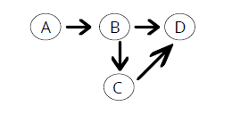

# Solve Graph

## Introducción

Un grafo/graph es un set de vertices conectados entre ellos por aristas.

### Undirected vs. Directed Graphs


### ¿Qué hay que hacer?

Escribe una función que determine si existe un path entre dos vertices de un graph.

El graph será representado como un objeto. Cada key representa un vértice. El valor, todos los vertices que pueden ser alcanzados.

El graph, será un *'directed graph'*.



Y lo representamos con un objeto:

```js
{
  a: ['b'],
  b: ['c', 'd'],
  c: ['d']
  d: []  
}
```

Como observamos, el nodo 'a' se conecta con el nodo 'b', el nodo 'b' con el nodo 'c' y 'd' y por último, el nodo 'c' con el nodo 'd'.
