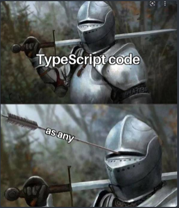

# TypeScript I

## Conceptos importantes

- El navegador recibe solamente archivos en formato "html", "css" y "js".
- Etapas o Tiempos de nuestro Código:
  - Tiempo de Compilación: Mientras escribimos nuestro código.
  - Tiempo de Ejecución: Cuando se ejecuta nuestro código.

## JavaScript

- Comenzó como un lenguage de scripts, para dotar de dinamismo a las páginas web del lado del cliente (en el navegador).
- Con el tiempo surgieron Node (entorno de ejecución del lado del servidor), librerías y frameworks que ampliaron su uso y funcionalidades mas allá de sus limitaciones.
- Esto produjo que se comenzaran a crear proyectos donde JavaScript dejó de se código de unas pocas líneas y se generaran proyectos completos en este lenguaje.

```js
//* Débilmente Tipado: No necesitamos declarar el tipo de dato.
let password = '1234';
//* Tipado Dinámico: Podemos modificar el tipo de dato de una variable.
password = 5678;
```

- Lo siguiente en JavaScript NO nos da un error:

```js
function suma(a, b) {
  return a + b;
}
console.log(suma(2, { b: 3 }));
```

## TypeScript

- TipeSctript es un superset de JavaScript
  - Toma todas las funcionalidades de JavaScript
  - Todo el código en JavaScript es compatible con TypeScript
  - Da nuevas funcionalidades a JavaScript
    - Detección de errores en tiempo de Compilación
    - Ayuda del editor de código (VSC)
- [Documentación de TypeScript](https://www.typescriptlang.org/docs/)

```ts
//* Fuertemente Tipado
let password: string = '1234';
//* Tipado Estático
password = '5678';

// Ayuda en VSC
let nombre: string = document.getElementById('InputName').value;
nombre?.charAt(2);

function suma(a: number, b: number) {
  return a + b;
}
console.log(suma(2, [{ b: 3 }]));
```

## Intalar/Desinstalar TypeScript de forma Global

```bash
# Instalar en forma Global
npm install -g typescript

# Verificar dependencias globales
npm ls -g --depth-0

# Verificar versión de TS
tsc -v

# Desinstalar TS Global
npm uninstall -g typescript
```

### Algunos comandos de TypeScript

```bash
# Compilar un archivo en particular:
tsc index.ts

# Crear archivo "tsconfig.json" de forma automática:
tsc –init 


```

- Configuración básica del archivo "tsconfig.json"

```json
{
  "compilerOptions": {
	// ----- ----- ----- -----
	//"target": "es2016",
	"target": "ES6",
	// ----- ----- ----- -----
	"module": "commonjs",
	"rootDir": "./",
	// ----- ----- ----- -----
	"outDir": "./dist", /* Specify an output folder for all emitted files. */
```

### Inicialización de proyecto en Node

```bash
npm init -yes
```

- Creamos script en el "package.json"
  - Podemos configurar "Compilar" y "Correr aplicación"
  - --watch: Compila ante el cambio en cualquier archivo

```json
	"scripts": {
		"start": "tsc && node ./dist/index.js",
		"dev": "tsc --watch"
```

## Evitar el uso de ANY



## ESLint

- Instalación:

```bash
npm install eslint @typescript-eslint/parser @typescript-eslint/eslint-plugin pretti
```

- Creamos ARCHIVO ".eslintrc.js" en la raíz del proyecto:

```js
module.exports = {
  parser: '@typescript-eslint/parser',
  plugins: ['@typescript-eslint'],
  extends: ['eslint:recommended', 'plugin:@typescript-eslint/recommended'],
  rules: {
    // Puedes añadir reglas personalizadas aquí
  },
};
```

- Creamos script en el "package.json"

```json
	"scripts": {
		"lint": "eslint . --ext .ts"
```
