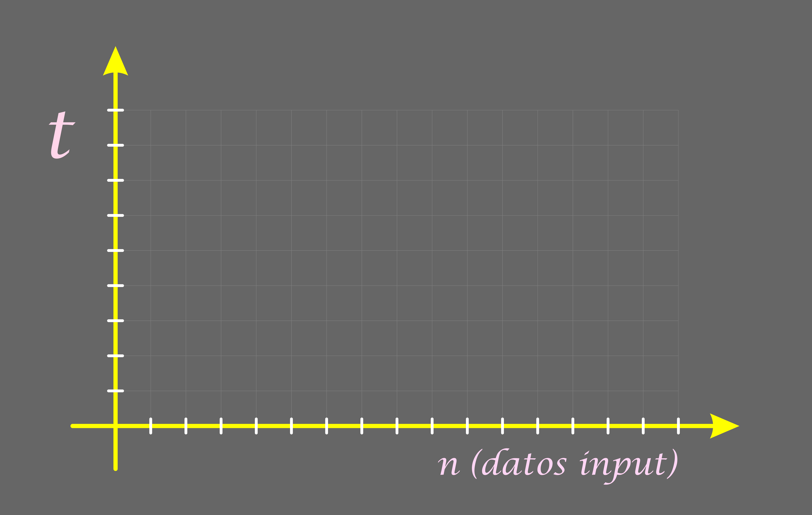
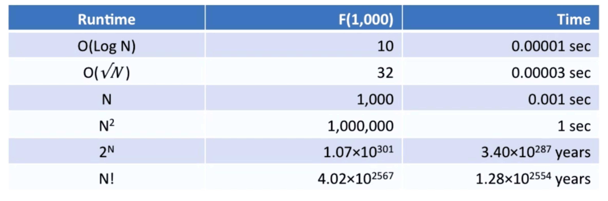
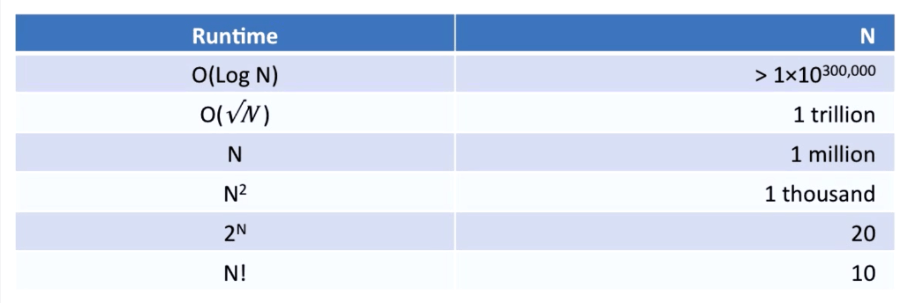
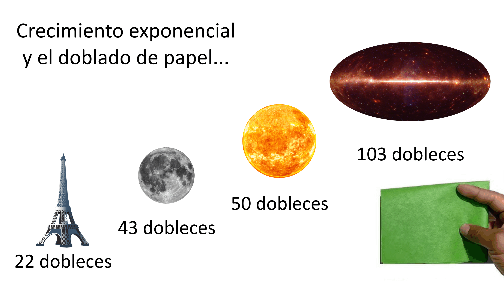

# Complejidad de Algoritmos

## Complejidad Temporal y BigO Notation

## Formas de Crecimiento

### ¿Cuánto tarda en procesar 1000 datos?

### ¿Qué cantidad de datos puede procesar en un segundo?

### Sobre el Crecimiento Exponencial

